<div align="center">

# 🎮 من الغرفة للقمة

### Game Dev Tycoon — نسخة عربية موسّعة بتقنية Three.js

<br>

[](https://abosalehg-ui.github.io/Game-dev/)
[](./LICENSE)

<br>

**محاكي تطوير ألعاب فيديو ثلاثي الأبعاد في ملف HTML واحد**

ابدأ من غرفة نومك.. طوّر ألعاباً، ابنِ سلاسل، وظّف فريقاً، وحقّق Prestige!

<br>

[العب الآن](https://abosalehg-ui.github.io/Game-dev/) · [صور](#-صور-من-اللعبة) · [الميزات](#-الميزات) · [كيف تلعب](#-كيف-تلعب) · [Easter Eggs](#-easter-eggs) · [التطوير](#-التطوير-محلياً)

<br>

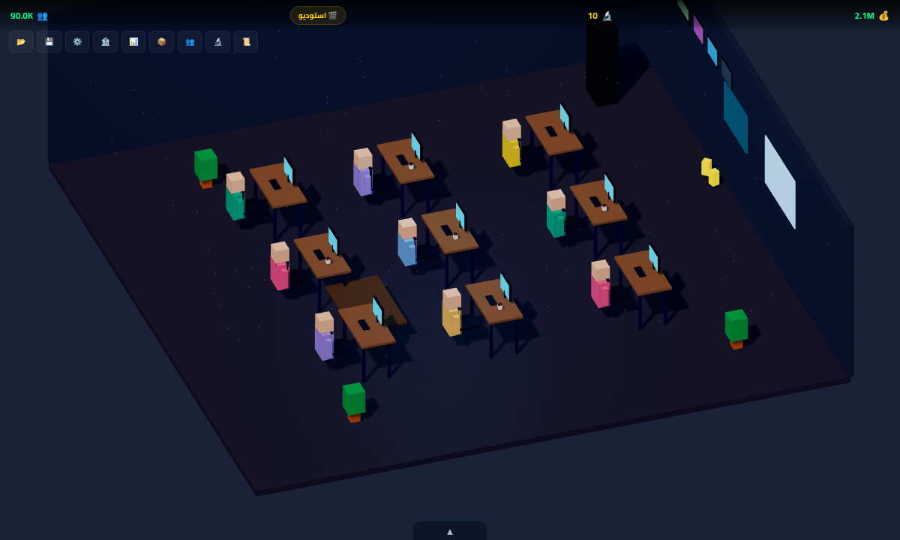

</div>

---

## 📖 عن اللعبة

**من الغرفة للقمة** لعبة محاكاة تطوير ألعاب فيديو مستوحاة من [Game Dev Tycoon](https://store.steampowered.com/app/239820/Game_Dev_Tycoon/)، مبنية بالكامل بتقنية **Three.js** في ملف HTML واحد. اللعبة باللغة العربية وتعمل مباشرة من المتصفح بدون تثبيت.

تأخذك اللعبة في رحلة من مطور مبتدئ في غرفة نومه إلى مدير إمبراطورية ألعاب في ناطحة سحاب، مروراً بـ 6 مراحل مختلفة — كل مرحلة بمشهد 3D فريد وتحديات متصاعدة، مع أنظمة عميقة للتسويق، التوظيف، الأبحاث، والسلاسل.

| | |
|---|---|
| 🏗️ **6 مراحل** من غرفة النوم إلى ناطحة السحاب | 🎯 **11 نوع** × **15 موضوع** بمصفوفة توافق |
| 👥 **5 أدوار** × **4 مستويات** للموظفين | 🔬 **15 عقدة** في شجرة الأبحاث |
| 📊 **4 استوديوهات منافسة** تنمو معك | 🏆 **23 إنجاز** و**19 بيضة فصح** |

---

## 📸 صور من اللعبة

### رحلة المراحل الست

من مكتب واحد في غرفة النوم إلى طابق كامل بـ 23 موظفاً — كل مرحلة مشهد Low-Poly مستقل بإضاءته وأثاثه.

| ١ · 🛏️ غرفة النوم | ٢ · 🚗 الكراج | ٣ · 🏢 مكتب صغير |
|:---:|:---:|:---:|
| 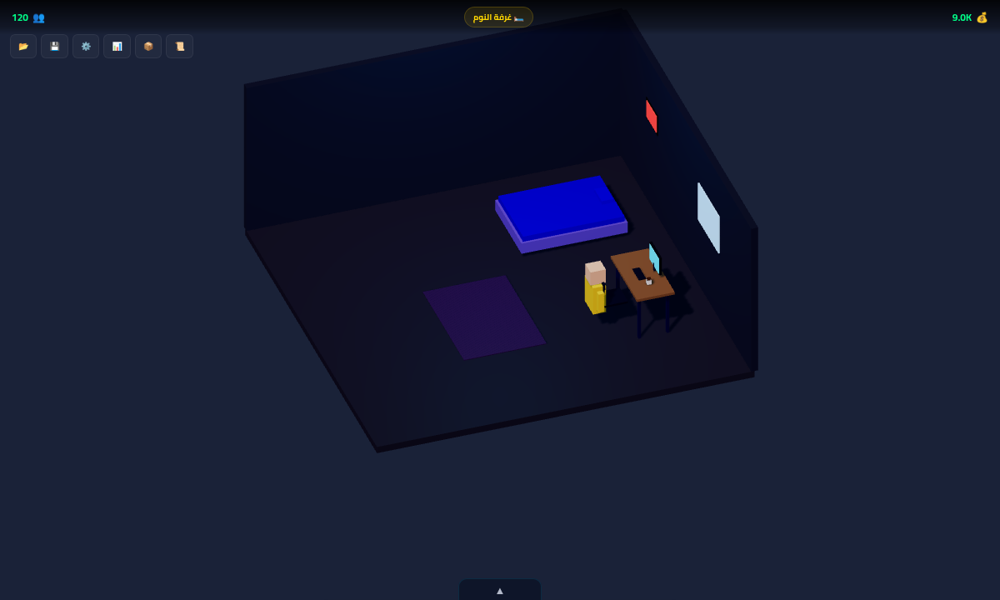 | 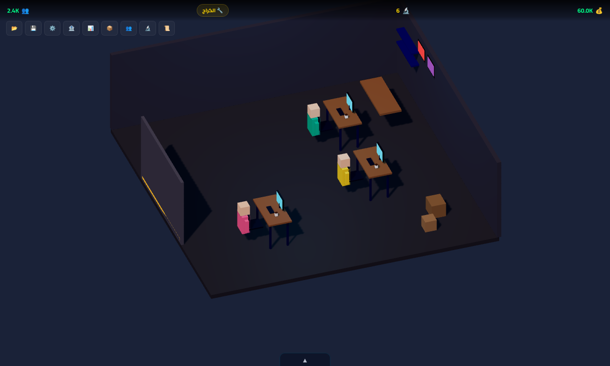 | 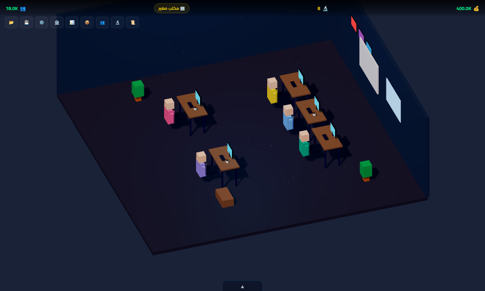 |
| **٤ · 🎬 استوديو** | **٥ · 🏙️ شركة** | **٦ · 🌆 ناطحة سحاب** |
| 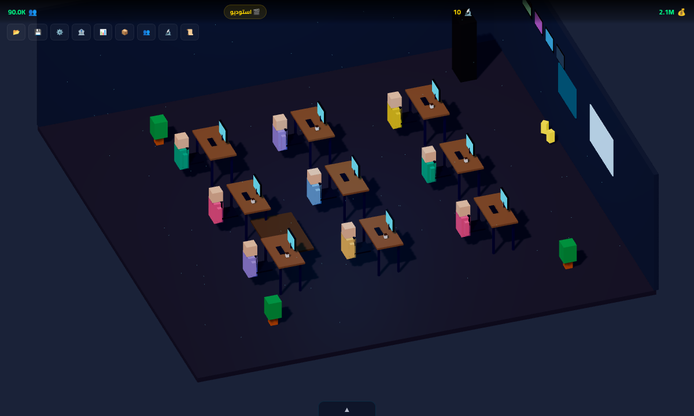 | 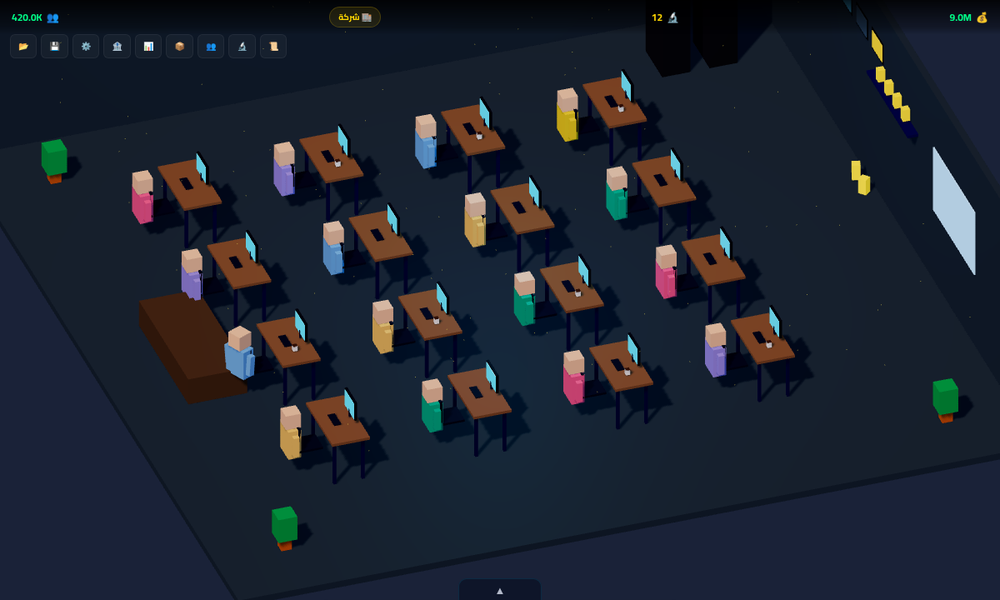 | 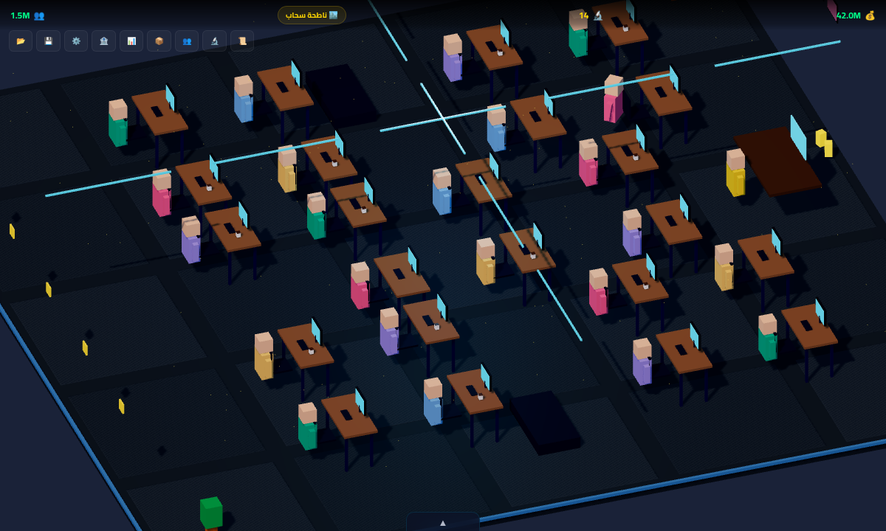 |

### لوحة التطوير — حيث تُصنع اللعبة

<div align="center">
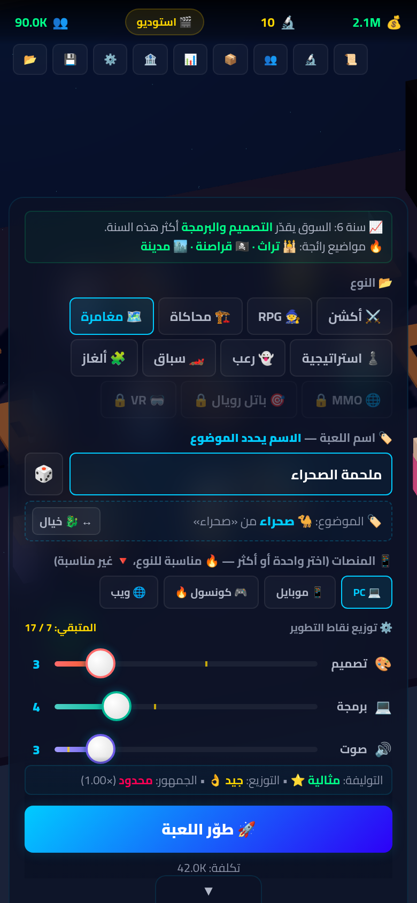
&nbsp;&nbsp;
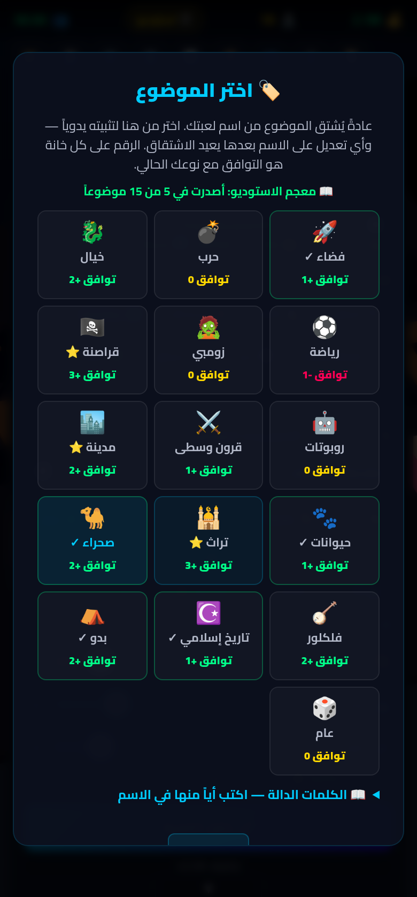
</div>

كل شيء في شاشة واحدة: أذواق السوق هذه السنة، النوع، **اسم اللعبة الذي يحدد موضوعها**، المنصات، توزيع النقاط، وتقييم مبدئي لاختيارك قبل أن تدفع. وإن أردت تثبيت موضوع بعينه، نقرة واحدة تفتح المنتقي (يمين) بتوافق كل موضوع مع نوعك.

### التقييم والسوق

<div align="center">
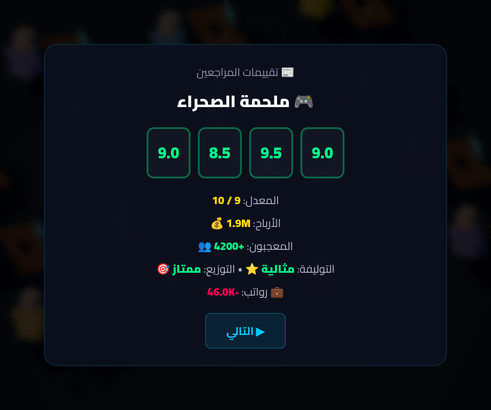
&nbsp;&nbsp;
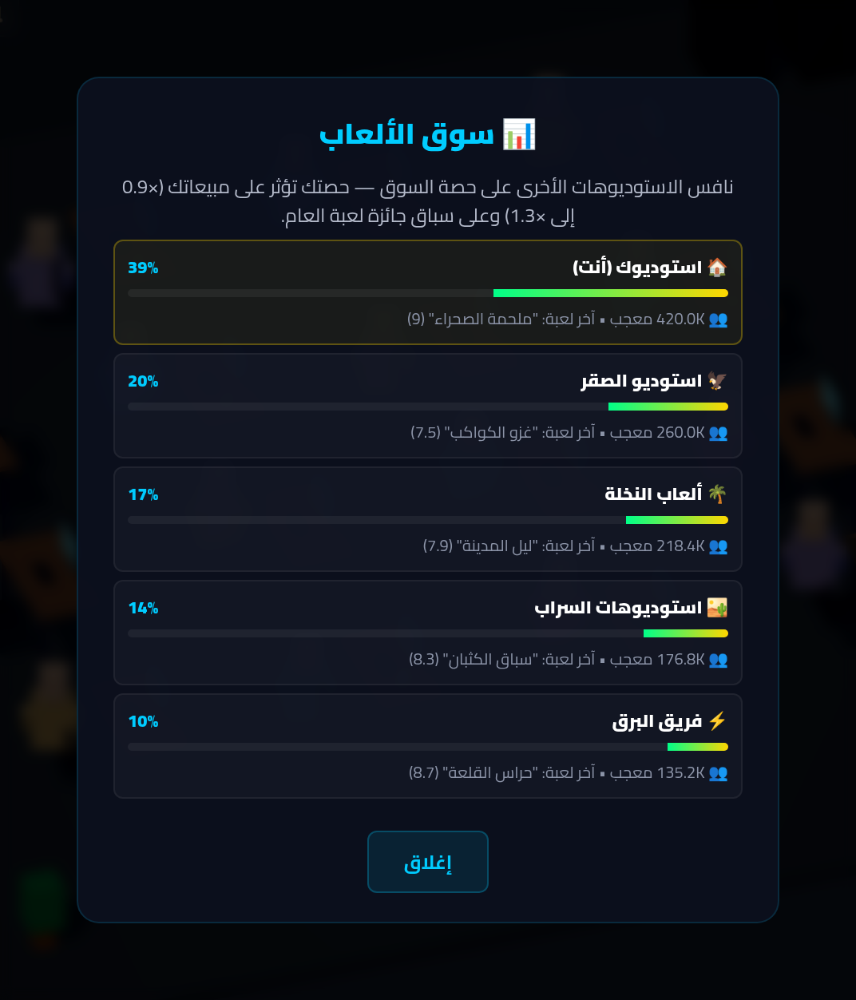
</div>

أربعة مراجعين يقيّمون لعبتك ويشرحون **لماذا** حصلت على درجتك، ولوحة السوق تعرض موقعك بين الاستوديوهات المنافسة.

### الأبحاث والفريق والليل

<div align="center">
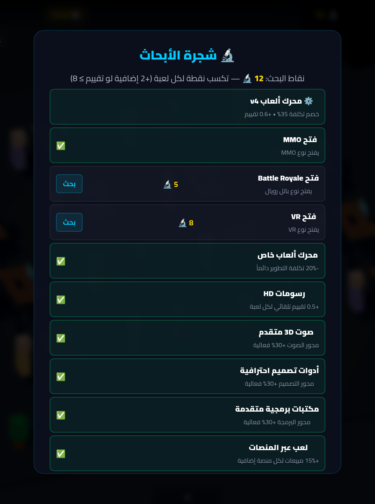
&nbsp;
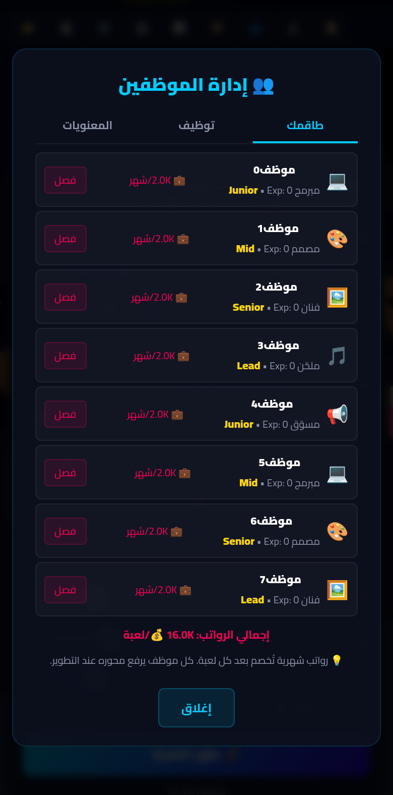
&nbsp;
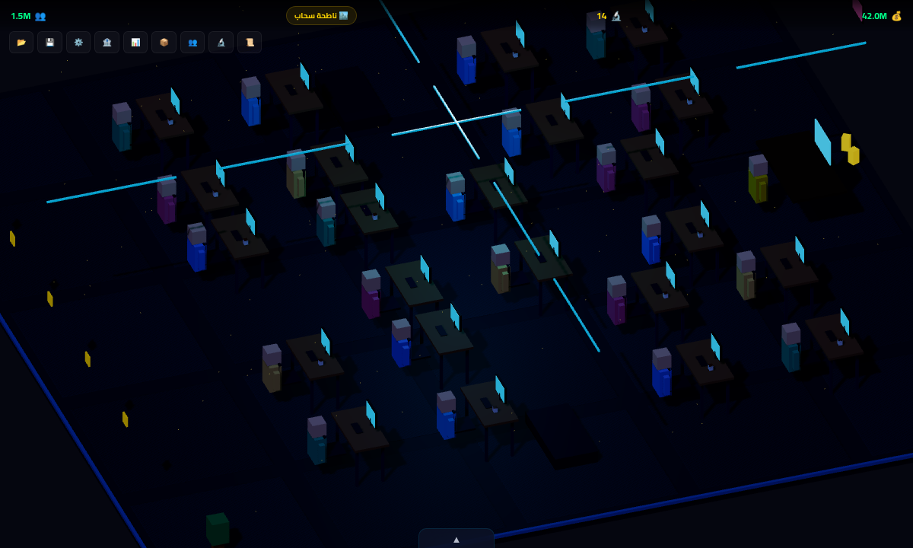
</div>

---

## ✨ الميزات

### 🧊 العالم والمشاهد

مشاهد ثلاثية الأبعاد حيّة بتقنية Three.js: **6 مراحل** بتصميم Low-Poly فريد مع إضاءة وظلال، وموظفون يتنفسون في الانتظار ويعملون بحماس عند التطوير، ويتمشون إلى ركن القهوة ☕ في أوقات الفراغ، ويقفزون احتفالاً بالنجاحات.

<details>
<summary><b>التفاصيل الكاملة</b></summary>

<br>

**🏗️ 6 مراحل تطور:**
غرفة نوم ← كراج ← مكتب صغير ← استوديو ← شركة ← ناطحة سحاب

**🖱️ كاميرا تفاعلية**
اسحب لتدوير المشهد حول المكتب، واستخدم عجلة الفأرة أو قرصة الأصابع للتقريب والإبعاد. زاوية رؤيتك تبقى محفوظة بين الإصدارات.

**🚶 تنقّل واقعي للموظفين** 🆕
الموظفون يمشون في **الممرات** بين المكاتب لا من خلالها: اللعبة تستخرج المساحة القابلة
للسير من أثاث الغرفة نفسها، وتبحث عن مسار (A*) ثم تُنعّمه إلى خطوط مستقيمة طبيعية،
مع دوران سلس عند المنعطفات.

**🌗 دورة نهار وليل**
الإضاءة تتغير مع تقدم السنة داخل اللعبة: صباح ← ظهيرة ← مساء ← ليل، مع توهج النوافذ ليلاً.

**🎊 احتفالات:**
قصاصات ملونة تتساقط في المشهد عند تقييم ≥ 8، وذهبية عند الفوز بجائزة لعبة العام!
كؤوس الجوائز تظهر في 3D عند الفوز بجائزة لعبة العام.

</details>

### 🎮 صناعة اللعبة

القرار الأساسي: **نوع** × **موضوع** × **منصات** × **توزيع نقاط**. مصفوفة توافق مخفية تكافئ التوليفات المنطقية، وأذواق السوق تتغيّر كل سنة فلا توجد وصفة تصلح للأبد — واللوحة تقيّم اختيارك **قبل** أن تدفع.

<details>
<summary><b>التفاصيل الكاملة</b></summary>

<br>

**🎯 نظام تطوير ألعاب:**
- **11 نوع** (مع 3 يفتحون بالأبحاث): أكشن، RPG، محاكاة، مغامرة، استراتيجية، رعب، سباق، ألغاز، MMO 🔒، باتل رويال 🔒، VR 🔒
- **15 موضوع يُختار بالكتابة لا بالنقر** 🆕: فضاء، حرب، خيال، رياضة، زومبي، قراصنة، روبوتات، قرون وسطى، مدينة، حيوانات، تراث، صحراء، فلكلور، تاريخ إسلامي، بدو
- نظام توافق مخفي بين الأنواع والمواضيع
- 3 محاور تطوير: تصميم / برمجة / صوت

**🏷️ الموضوع مدموج في اسم اللعبة** 🆕
لم يعد الموضوع صفّاً من 15 شريحة مزدحمة — بل صار اسم لعبتك هو ما يحدده:
«ملحمة **الصحراء**» لعبة صحراء 🐪، و«حصار **المجرة**» لعبة فضاء 🚀.
- السطر تحت حقل الاسم يخبرك بالموضوع الذي فُهم **وبالكلمة التي دلّت عليه**، فلا شيء يحدث في الخفاء.
- مؤشر «التوليفة» يتحدّث **أثناء الكتابة**، فترى أثر الاسم على التوافق قبل أن تدفع.
- المطابقة تتجاهل التشكيل وصور الهمزة وتفكّ السوابق (الـ، والـ، بالـ)، وتلتقط الجمع والنسبة.
- في تركيب الإضافة يفوز **الاسم الثاني** لأنه الموضوع الحقيقي: «ملحمة الصحراء» صحراء لا خيال.
- اسم بلا كلمة دالة («رحلة الأمل») → موضوع **عام 🎲** بتوافق 0: لا مكافأة ولا عقوبة.
- بحاجة لتثبيت موضوع بعينه؟ انقر السطر ليفتح منتقياً كامل الشاشة فيه الـ16 موضوعاً وتوافق كل منها مع نوعك، وقائمة الكلمات الدالة كاملة. أي تعديل على الاسم بعدها يعيد الاشتقاق.
- أسماء بيض الفصح (فيفا، ماريو، صراع العروش…) تحمل موضوعها الخاص وتتقدّم على القاموس.
- الأجزاء التالية (Sequels) تحتفظ بموضوع سلسلتها 🔒 مهما غيّرت اسمها.
- **القاموس 333 كلمة** 🆕 تشمل المرادفات وأسماء الأماكن والألفاظ الخليجية:
  «ليالي الدرعية» تراث، و«غوص اللؤلؤ» تراث لا قراصنة، و«هجن الشمال» بدو،
  و«ليوة الفجر» فلكلور. ولا كلمة واحدة تنتمي لموضوعين — اختبار يمنع ذلك في CI.

**📈 أذواق سوق متغيّرة كل سنة** 🆕
النسب المثالية للمحاور تنحرف كل سنة داخل اللعبة، و3 مواضيع تصبح «رائجة ⭐» بتوافق أعلى.
لا توجد وصفة واحدة تصلح للأبد — راقب لوحة السوق في أعلى لوحة التطوير.

**🎯 تغذية راجعة قبل الدفع** 🆕
اللوحة تقيّم اختيارك **قبل** التطوير: جودة التوليفة، دقة توزيع النقاط، وسعة الجمهور.
علامة ذهبية على كل شريط تُظهر النسبة المثالية للنوع المختار.

**⚖️ نطاق المشروع قرار حقيقي** 🆕
النقاط فوق 70% من السقف ترفع التكلفة 5% لكل نقطة — مشروع مركّز قد يتفوّق على مشروع ضخم.
وإن ضاقت الميزانية، زر «✂️ قلّص النطاق» يضبط التوزيع تلقائياً.

**⏳ قرار منتصف الإنتاج** 🆕
شريط التطوير يتوقف مرة واحدة ليعرض عليك مقايضة حقيقية: تمديد مقابل مال،
أو Crunch مقابل معنويات، أو الالتزام بالموعد.

**🔍 مرحلة ضمان الجودة (QA)**
قبل كل إطلاق اختر:
- ⚡ **إطلاق سريع** (مجاناً، لكن خطر بَقّات)
- ⚙️ **اختبار عادي** (10% من التكلفة)
- 🛡️ **اختبار شامل** (25% من التكلفة + بونص تقييم)

**📢 نظام التسويق والحملات**
- مقياس Hype قبل الإطلاق
- 3 مستويات حملة: صغيرة (5K) / متوسطة (25K) / كبيرة (100K)
- ROI متفاوت + بونص معجبين قبل الإطلاق
- بحث "تحليلات سوقية" يضاعف فعاليتها

**📱 4 منصات نشر — لكل منها تخصّصها** 🆕
PC 💻 / موبايل 📱 / كونسول 🎮 / ويب 🌐
- **ملاءمة حسب النوع**: الكونسول يتفوّق في الأكشن والسباق، والموبايل في الألغاز،
  والـ PC في الاستراتيجية والمحاكاة. علامة 🔥 / 🔻 على كل منصة توضح ملاءمتها لنوعك.
- **تشبّع الجمهور**: كل منصة إضافية تصل إلى شريحة أصغر (×1 ← ×0.85 ← ×0.7 ← ×0.6)،
  فاختيار «كل المنصات» لم يعد الجواب الصحيح دائماً.
- بحث "اللعب عبر المنصات" يعطي +15% لكل منصة إضافية

**🎚️ 3 مستويات صعوبة**
- مبتدئ: 15K بداية + 30% مكافآت
- عادي: 10K بداية + توازن متوسط
- صعب: 7K بداية + 30% تكلفة إضافية

</details>

### 📊 بعد الإطلاق — السوق والمال

لعبتك لا تُطلق في فراغ: **4 استوديوهات منافسة** تصدر ألعاباً وتكسب معجبين وتتحسن مع السنين، وحصتك السوقية تؤثر على مبيعاتك مباشرة. ألعابك الناجحة تصبح **IPs** تبني عليها سلاسل و DLC.

<details>
<summary><b>التفاصيل الكاملة</b></summary>

<br>

**📊 شركات منافسة (AI)**
4 استوديوهات منافسة (استوديو الصقر 🦅، ألعاب النخلة 🌴، استوديوهات السراب 🏜️، فريق البرق ⚡) تصدر ألعاباً وتكسب معجبين وتتحسن مع السنين:
- حصتك السوقية تؤثر على مبيعاتك (×0.9 إلى ×1.3)
- سباق سنوي على جائزة لعبة العام — قد يخطفها منافس!
- لوحة سوق 📊 تعرض الترتيب وآخر إصدارات المنافسين

**📦 السلاسل والـ DLC**
- ألعابك بتقييم ≥ 7 تُحفظ كـ IPs
- **جزء ثانٍ** بنصف التكلفة + بونص من تقييم الأصلي
- **DLC** بـ 20% من التكلفة لدخل سريع
- إرهاق السلسلة بعد الجزء الثالث

**📜 عقود الناشرين**
ناشرون كبار يعرضون عليك تطوير ألعاب حصرية: دفعة ثابتة + مكافأة عند الجودة العالية أو غرامة عند الإخفاق — لكن اللعبة ملك للناشر (بدون IP) والمهلة إصداران فقط.
- **عقود تطلب موضوعاً بعينه** 🆕: نحو نصف العروض تحدّد الموضوع أيضاً لا النوع وحده —
  «لعبة رعب صحراوية» — فتصير التسمية تحدّياً عليه مال. الموضوع المطلوب يُختار دائماً
  من المتوافق مع النوع (توافق ≥ 0) فلا يُعرض عليك عقد يستحيل الوفاء به،
  والدفعة أعلى بـ **30%** مقابل القيد الإضافي.
- لافتة العقد تنبّهك **أثناء الكتابة** إن دلّ اسمك على موضوع آخر، فلا تُفاجأ عند التسليم.

**🏦 قروض بنكية**
خذ قرضاً (بسقف يكبر مع مرحلتك) بفائدة حسب الصعوبة، يُسدد على 8 أقساط تلقائية. وعند حافة الإفلاس، البنك يعرض عليك قرض إنقاذ أخير!

**🏆 جائزة لعبة العام**
كل 4 ألعاب = سنة جديدة. أعلى لعبة بتقييم ≥ 8.5 تفوز بـ 100K مكافأة + 2000 معجب + كأس 3D في المشهد.

**⭐ نظام Prestige**
بعد الإفلاس، ابدأ من جديد مع نقاط Prestige (+10% أرباح لكل نقطة) — تُحسب من عدد الألعاب، المال الأعلى، والجوائز.

**📊 اقتصاد متوازن:**
- نظام تقييم من 4 مراجعين
- مبيعات تعتمد على التقييم، المعجبين، المنصات، التسويق، الأبحاث، السلاسل، والصعوبة
- إمكانية الإفلاس وإعادة البدء

**🎲 23+ حدث عشوائي:**
ترندات، أزمات اقتصادية، اختراق أمني، عرض استحواذ، قرصنة، استقالة موظف، **رمضان، موسم الرياض، العيد، انقطاع كهرباء، استراحة قهوة، إحباط الفريق، عيد ميلاد في المكتب** وغيرها

**💼 العمل الحر:**
نظام أعمال جانبية عند نقص المال — اكسب دخلاً بسيطاً للبقاء دون التأثير على سمعتك

</details>

### 👥 الاستوديو — الفريق والنمو

وظّف 5 أدوار متخصصة عبر 4 مستويات، وراقب معنوياتهم لأنها إنتاجيتهم. وفي المقابل: **شجرة أبحاث من 15 عقدة**، ومحرك ألعاب خاص ترقّيه عبر 4 إصدارات، ومعارض سنوية تستثمر فيها.

<details>
<summary><b>التفاصيل الكاملة</b></summary>

<br>

**👥 إدارة الموظفين**
- **5 أدوار متخصصة**: مصمم 🎨، مبرمج 💻، فنان 🖼️، ملحّن 🎵، مسوّق 📢
- **4 مستويات**: Junior → Mid → Senior → Lead
- توظيف انتقائي مع تكلفة + رواتب شهرية
- خبرة وترقيات تلقائية مع كل لعبة
- كل موظف يرفع محوره عند التطوير

**😄 معنويات الفريق**
معنويات الاستوديو (0-100) تتأثر بالنجاحات والإخفاقات وضغط الإطلاق السريع، وتؤثر على إنتاجية موظفيك. ارفعها بالحفلات 🎉 والمكافآت 💰 — وانتبه: تحت 30 تبدأ الاستقالات!

**🔬 شجرة أبحاث (15 عقدة)**
- نقاط بحث: +1 لكل لعبة، +2 إضافية لتقييم ≥ 8
- فتح أنواع جديدة (MMO، باتل رويال، VR)
- محرك ألعاب خاص (-20% تكلفة)
- رسومات HD، صوت 3D متقدم، أدوات احترافية
- E-sports، Modding، حفظ سحابي، فن AI...

**⚙️ إصدارات المحرك (v1 → v4)**
بعد بحث "محرك ألعاب خاص"، رقِّ محركك بالمال ونقاط البحث: كل إصدار يزيد خصم التكلفة (حتى 35%) ويضيف بونص تقييم (حتى +0.6).

**🎪 معارض ومؤتمرات سنوية**
- E3 العالمي
- GDC العربي
- معرض الألعاب السعودي
- خيارات متعددة: من حضور بسيط إلى كشف لعبة جديدة

</details>

### ⚙️ المنصة والجودة

حفظ آمن مع هجرة للنسخ القديمة وتحقّق كامل من الملفات المستوردة، إمكانية وصول تلتزم بـ WCAG AA، و**23 إنجازاً** و**19 بيضة فصح** تكافئ الاستكشاف.

<details>
<summary><b>التفاصيل الكاملة</b></summary>

<br>

**💾 حفظ التقدم:**
- حفظ تلقائي في المتصفح
- تصدير/استيراد مضغوط بـ Base64
- إصدار الحفظ + هجرة آمنة للنسخ القديمة (v1 ← v5)
- **تحقّق كامل من الملفات المستوردة**: أي قيمة غير معروفة تُرفض قبل تطبيقها،
  والاستيراد الفاشل يرجع إلى حالتك السابقة بدل تركك في حالة نصفية

**♿ إمكانية وصول** 🆕
- تحكم كامل بلوحة المفاتيح (الأسهم/Home/End على الشرائح، Escape لإغلاق اللوحات)
- احترام إعداد النظام «تقليل الحركة» (prefers-reduced-motion)
- سمات ARIA وحوارات معلَّمة لقارئات الشاشة، والتكبير بالقرص مسموح
- تباين ألوان يلتزم بـ WCAG AA للنصوص الثانوية

**🏆 23 إنجاز**
من "البداية" إلى "Prestige أول"، مروراً بـ "باني السلاسل" و"مدير ناجح" و"متصدر السوق" و"هزمت المنافسين"

**📖 معجم الاستوديو** 🆕
إنجاز طويل المدى يخصّ نظام التسمية: أصدر لعبة في **كل موضوع من الـ15** — بالكتابة وحدها.
منتقي الموضوع يعرض تقدّمك ويضع ✓ على ما أصدرت فيه، و«نصف المعجم» علامة في منتصف الطريق.

**🥚 19 Easter Egg**
سمِّ لعبتك باسم لعبة مشهورة واحصل على مكافأة (مع 5 ألعاب عربية أصيلة!)

**⚙️ إعدادات شاملة**
- سلايدر صوت + كتم
- وضع داكن/فاتح
- عرض السنة و Prestige
- مسح الحفظ بأمان

**📱 محسّن للموبايل:**
- سلايدرات أكبر للمس
- واجهة متجاوبة
- عمل من المتصفح مباشرة

</details>

---

## 🕹️ كيف تلعب

1. **اختر صعوبتك** عند البداية — مبتدئ / عادي / صعب
2. **اختر النوع، ثم اكتب اسم لعبتك** — الاسم هو ما يحدد الموضوع («ملحمة الصحراء» = صحراء 🐪).
   السطر تحت الحقل يؤكد لك الموضوع والكلمة التي دلّت عليه، و🎲 يولّد اسماً جاهزاً
3. **اختر المنصات** — راقب مؤشر «التوليفة» في أسفل اللوحة، و🔥/🔻 على المنصات
4. **وزّع نقاط التطوير** — العلامة الذهبية على كل شريط = النسبة المثالية لنوعك هذه السنة،
   وانتبه: النقاط فوق 70% من السقف ترفع التكلفة
5. **حملة تسويقية** — اختر بدون / صغيرة / متوسطة / كبيرة
6. **مرحلة QA** — إطلاق سريع أم اختبار شامل؟
7. **طوّر اللعبة** — شاهد موظفيك يعملون، وقرّر عند توقف شريط الإنتاج
8. **تابع التقييمات** — 4 مراجعين يقيّمون لعبتك
9. **بعد كل لعبة** — تعلّم في شجرة الأبحاث 🔬 ووظّف فريقاً 👥
10. **سلاسل و DLC** — استفد من ألعابك الناجحة (تقييم ≥ 7) من قائمة 📦
11. **معارض** — استثمر في E3 / GDC / معرض الألعاب السعودي
12. **راقب المنافسين** — من لوحة السوق 📊، حصتك تؤثر على مبيعاتك
13. **عقود وقروض** — اقبل عقود الناشرين 📜 لدخل مضمون، واستعن بالبنك 🏦 عند الحاجة
14. **اعتنِ بفريقك** — معنوياتهم 😄 = إنتاجيتهم، والحفلات ليست ترفاً!
15. **جائزة لعبة العام** — حقّق ≥ 8.5 واهزم أفضل لعبة منافسة لتربح اللقب
16. **أفلست؟** — استخدم Prestige للبداية بقوة!

> 💡 **نصيحة:** جرب كتابة "فطحل" أو "أنرذد" أو أسماء ألعاب مشهورة في حقل اسم اللعبة!

---

## 🥚 Easter Eggs

اكتب اسم لعبة مشهورة في حقل **"اسم اللعبة"** للحصول على مكافأة مبيعات:

| الاسم | المكافأة |
|-------|---------|
| ماريو 🍄 | ×2 |
| زيلدا 🗡️ | ×2 |
| ماينكرافت ⛏️ | ×2 |
| جي تي أي 🚗 | ×2 |
| بوكيمون 🐱 | ×2 |
| كول أوف ديوتي 🎯 | ×2 |
| **فطحل 🧠** | ×2 |
| **أنرذد 🏺** | ×2 |
| **صراع العروش 👑** | ×2 |
| **دحديح 😎** | ×1.5 |
| **الفهد 🐆** | ×1.5 |
| وغيرها... | 🔍 اكتشفها! |

> 🏷️ كل بيضة فصح تحمل **موضوعها الخاص** أيضاً: «فيفا» تجعل لعبتك ⚽ رياضة، و«صراع العروش» ⚔️ قرون وسطى.

---

## 🛠️ التقنيات

| التقنية | الاستخدام |
|---------|-----------|
| **Three.js r185** (ES Modules) | المشاهد ثلاثية الأبعاد — حزمة مُشذَّبة (130KB مضغوطة) مع تجميع الأشكال الساكنة ومشاركة الموارد |
| **HTML/CSS** | واجهة المستخدم |
| **خط Cairo** | مُضمَّن محلياً في `vendor/fonts/` (خط متغيّر، 88KB) |
| **Web Audio API** | المؤثرات الصوتية (AudioContext موحّد) |
| **Vanilla JS** | منطق اللعبة |
| **localStorage** | حفظ التقدم تلقائياً |
| **Base64** | ضغط ملف الحفظ المُصدَّر |

> ملف HTML واحد. **لا يوجد أي طلب لطرف خارجي**: Three.js والخط مُضمَّنان في `vendor/`
> ومُخزَّنان مسبقاً في الـ Service Worker، فاللعبة تعمل بالكامل دون إنترنت من أول زيارة
> ولا تُسرِّب أي بيانات عن اللاعب.

---

## 🧑‍💻 التطوير محلياً

اللعبة كلها في `index.html` (بلا خطوة بناء). للتشغيل والاختبار:

```bash
# 1) شغّل خادماً محلياً (ES Modules تحتاج http لا file://)
python3 -m http.server 8000     # ثم افتح http://localhost:8000

# 2) أدوات التطوير (Node 18+)
npm install                      # يثبّت Playwright للاختبار
npm run check                    # فحص صياغة سريع لـ index.html و sw.js
npm test                         # كل الاختبارات (دخان + اشتقاق الموضوع + سلامة الحفظ + جلسة طويلة)
npm run test:smoke               # دورة تطوير كاملة في المتصفح
npm run test:topic               # اشتقاق الموضوع من الاسم (22 حالة) + تدفّق الاختيار اليدوي وقفل السلاسل
npm run test:save               # انحدارات الحفظ والاستيراد (25 فحصاً)
npm run test:path                # تنقّل الموظفين على المراحل الست (لا اختراق للأثاث)
npm run test:play                # 26 إصداراً متتالياً — يثبت أن التدفق لا يتعطّل
npm run three                    # إعادة بناء حزمة Three.js المُشذَّبة (يحتاج إنترنت)
npm run shots -- /tmp/after بعد  # صور المراحل الست للمقارنة البصرية (الواجهة مخفية)
npm run shots:readme             # إعادة توليد صور README في docs/screenshots/
npm run balance                  # محاكاة اقتصادية (تقرأ الثوابت من index.html)
npm run icons                    # إعادة توليد أيقونات PWA (يتطلب Python + Pillow)
```

**ملاحظات مهمة للصيانة:**

- **إصدار الـ Service Worker:** عند أي تعديل على `index.html` أو `vendor/`، ارفع
  `VERSION` في `sw.js` وإلا بقي اللاعبون العائدون على نسخة مخزّنة قديمة.
  (فحص CI في `tools/check-sw-version.mjs` يمسك هذا في الـ PRs.)
- **حالة الحفظ:** أي حقل يبدأ اسمه بـ `_` هو حالة جلسة مؤقتة **لا تُحفظ** إطلاقاً.
  عند تغيير مخطط الحفظ ارفع `SAVE_VERSION`، أضف خطوة في `migrateSave`، ووسّع
  `sanitizeSave` — وهي **الجهة الوحيدة** المسؤولة عن التحقق من الحدود والأنواع.
- **`saveGame()` لا يكتب شيئاً قبل `startGame()`** (راية `_started`). هذا مقصود:
  `initState()` تعمل عند تحميل الوحدة، ولولا هذه الراية لكان معالج `beforeunload`
  يكتب الحالة الافتراضية فوق حفظ اللاعب عند إعادة تحميل شاشة البداية.
  أي كود جديد يلمس `localStorage` يجب أن يحترم الراية (انظر `ResetGame`).
- **أي نص من اللاعب أو من ملف حفظ يُعرَض بـ `textContent` لا `innerHTML`.**
  المخالفة الأخيرة (`employees[].name` في `RenderEmps`) كانت ثغرة تنفيذ سكربت.
- **موازنة اللعبة كلها في `BALANCE`** أعلى قسم «Release pipeline»، وجدول `STG`.
  بعد أي تعديل شغّل `npm run balance` — الأداة تقرأ الجدول من `index.html` مباشرة.
- **اشتقاق الموضوع من الاسم** يعيش في `TOPIC_WORDS` و`normAr()` و`detectTopic()`.
  أي كلمة جديدة في القاموس تستحق حالة في `tests/topic-detect.mjs` — الدالة صارت
  منطق لعبة لا مجرد مساعد واجهة، وهي ما يحدّد التوافق والمبيعات.
- **الموارد الرسومية مشتركة ومُجمَّعة:** `boxGeo()`/`stdMat()` يعيدان كائنات مخزّنة،
  و`batchStatic()` يدمج الأشكال الساكنة بعد كل `buildRoom`. لذا **لا تتلف** أي
  geometry أو material إلا إن كان `userData.owned` صحيحاً (انظر `purge()`)،
  وأي شيء متحرك يجب أن يكون داخل مجموعة عليها `userData.dyn`.
- **صور الـ README مُولَّدة** بـ `tools/shot-readme.mjs` ومحفوظة في `docs/screenshots/`.
  بعد أي تغيير بصري أعد توليدها والتزم بالنتيجة — الصورة القديمة وعد قديم.
- **CI:** يعمل تلقائياً على كل PR: فحص الصياغة ← الدخان ← اشتقاق الموضوع ← سلامة الحفظ
  ← التنقّل ← جلسة طويلة ← تقرير الموازنة ← فحص إصدار الـ SW.
- **ترقية Three.js:** `vendor/three.module.js` **مُولَّد** بـ `tools/build-three.mjs`
  (حزمة مُشذَّبة إلى 20 رمزاً فقط: 130KB مضغوطة مقابل 404KB للحزمة الكاملة). لا تعدّله
  يدوياً. عند الترقية: `node tools/build-three.mjs <version>` ثم **قارن الصور**
  بـ `tools/shot-stages.mjs` و`tools/compare-shots.mjs` — إدارة الألوان ونموذج
  الإضاءة تغيّرا داخل نطاق الإصدارات، والمقارنة الرقمية هي ما يمسك ذلك.
- **إدارة الألوان مفعّلة** (افتراض Three.js الحديث) وهي أصحّ فيزيائياً لكنها تُعتِم
  الدرجات الوسطى. لذا `LIGHT_GAIN` يضاعف منحنى الإضاءة كله وACES يلطّف الإبرازات.
  أي تعديل على الإضاءة يجب أن يُتحقَّق بمقارنة الصور لا بالعين وحدها.
- **مساحة السير مستخرجة تلقائياً** من الأثاث في `collectObstacles()` (كل جسم ساكن
  يقطع نطاق ارتفاع الجسم). لا قوائم ممرات يدوية — أي أثاث جديد يصبح عائقاً من نفسه،
  لكن `buildNav()` **يجب** أن تعمل قبل `batchStatic()` التي تدمج الأثاث.

---

## 📱 التوافق

- ✅ الكمبيوتر (Chrome, Firefox, Edge, Safari)
- ✅ الجوال (Android, iOS) — سلايدرات أكبر للمس، ومختبر حتى عرض 320px
- ✅ يعمل بدون تثبيت — مباشرة من المتصفح، وبدون إنترنت بعد أول زيارة
- ✅ يدعم الوضع الداكن والفاتح
- ✅ لوحة مفاتيح كاملة + قارئات الشاشة + إعداد «تقليل الحركة»

---

## 📄 الترخيص

```
© 2026 Game-dev - All Rights Reserved
```

تطوير: **عبدالكريم العبود**
📧 abo.saleh.g@gmail.com

---

<div align="center">

**[🎮 العب الآن](https://abosalehg-ui.github.io/Game-dev/)**

<sub>صُنع بـ ❤️ وكثير من القهوة ☕</sub>

</div>
